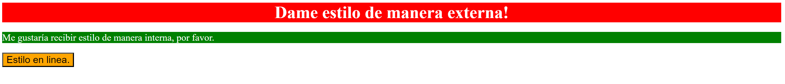

# Métodos para agregar CSS
En este ejercicio se practicará cómo agregar CSS a un archivo HTML utilizando los tres métodos: CSS externo, CSS interno y CSS en línea. Solo debes usar selectores de tipo para este ejercicio al agregar estilos a través de los métodos externo e interno. También debes usar palabras clave para los colores (por ejemplo, "azul") en lugar de usar valores RGB o HEX.

Hay tres elementos a los que puedes agregar estilos, cada uno de los cuales utiliza un método diferente para agregarle CSS, como se indica en la imagen de resultado a continuación. Todos los demás ejercicios en esta sección tendrán un archivo CSS proporcionado y vinculado, pero para este ejercicio tendrá que crear el archivo y vincularlo en el archivo HTML tu mismo. Se trata de practicar el uso de estos diferentes métodos y obtener la sintaxis correcta.

> ## consejo:
> No te preocupes por los detalles de estos ejercicios que no se mencionan específicamente en la sección de ejercicios o autoevaluación. Debido a que los resultados deseados son capturas de pantalla, tu navegador puede mostrar una fuente diferente, los colores pueden aparecer diferentes en tu máquina o el espacio entre los elementos puede verse diferente. Solo preocúpate por los elementos específicos que se supone que debes aprender para cada ejercicio.

Las propiedades que necesitas agregar a cada elemento son:

* `div`: un fondo rojo, texto blanco, un tamaño de fuente de 32 px, alineado al centro y en negrita
* `p`: un fondo verde, texto blanco y un tamaño de fuente de 18px
* `botón`: un fondo naranja y un tamaño de fuente de 18px

## Resultado deseado

### Autoevaluación
- ¿Utilizaste los tres métodos para agregar CSS a un archivo HTML?
- ¿Se enlazó correctamente el archivo CSS externo en el archivo HTML?
- ¿El elemento `div` tiene CSS agregado a través del método externo?
- ¿El elemento `p` tiene CSS agregado a través del método interno?
- ¿El elemento `button` tiene CSS agregado a través del método en línea?