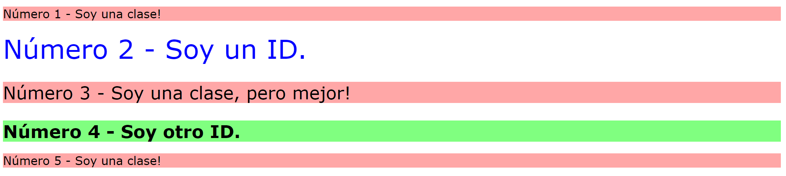

# Selectores de clase e ID
Saber cómo agregar atributos de clase e ID a elementos HTML, así como usar sus respectivos selectores, es invaluable. Es importante practicar su uso.

Hay varios elementos en el archivo HTML provisto, a los que deberás agregar atributos de clase o ID, como se indica en la imagen de resultado a continuación. A continuación, deberás agregar reglas en el archivo CSS proporcionado utilizando la sintaxis de selector correcta. Examina la imagen de resultado con cuidado e intenta tener en cuenta qué elementos tienen un estilo similar (clases), cuáles pueden ser completamente únicos del resto (ID) y cuáles tienen ligeras variaciones de los demás (clases múltiples).

No es del todo importante qué clase o valores de ID usa, ya que el enfoque aquí es poder agregar los atributos y usar la sintaxis de selector correcta para diseñar elementos. Para los colores de este ejercicio, intenta utilizar un valor que no sea una palabra clave (RGB, HEX o HSL). Las propiedades que necesitas agregar a cada elemento son:

* **Todos los elementos impares**: un fondo rojo claro/rosa y una lista de fuentes que contienen `Verdana` y `DejaVu Sans` con `sans-serif` como reserva
* **El segundo elemento**: texto azul y un tamaño de fuente de 36px
* **El tercer elemento**: además de los estilos para todos los elementos impares, agregue un tamaño de fuente de 24px
* **El cuarto elemento**: un fondo verde claro, un tamaño de fuente de 24 px y negrita

Sugerencia: en VS Code, puedes cambiar los colores de formato que se muestran en RGB, HEX o HSL al pasar el cursor sobre el valor del color en el CSS y hacer clic en la parte superior de la ventana emergente que aparece.

> ### Nota:
> Parte del ejercicio es agregar una fuente a _algunos_ de estos elementos. La fuente de tu navegador puede ser diferente a la que se muestra en la imagen de resultado deseada. Siempre y cuando confirmes que las fuentes _están_ siendo aplicadas a las líneas correctas, cualquier diferencia está bien para este ejercicio.

## Resultado deseado

### Autoevaluación
- ¿Los elementos impares `p` comparten una clase?
- ¿Los elementos `div` con números pares tienen ID únicos?
- ¿El elemento Número 3 tiene múltiples clases?