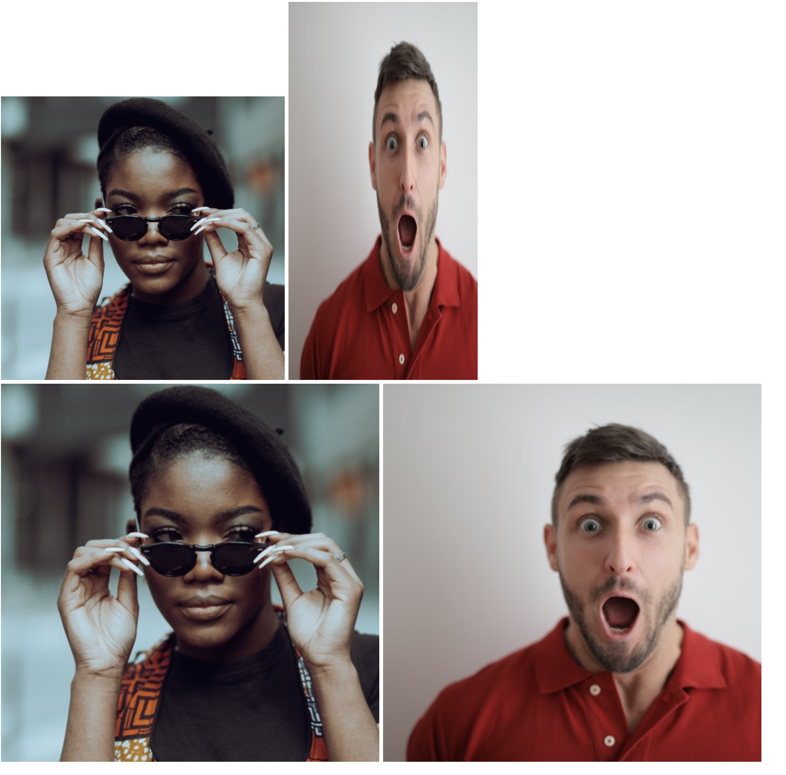

# Encadenando selectores

Con este ejercicio, se incluye un archivo HTML completo, por lo que solo tendrás que editar el archivo CSS. Para este ejercicio, es más importante comprender cómo funciona el encadenamiento de diferentes selectores que cómo agregar los atributos.

Hay dos imágenes para diseñar, cada una con dos nombres de clase, donde se comparte uno de los nombres de clase. El objetivo aquí es encadenar los selectores para ambos elementos, de modo que cada uno tenga un estilo único aplicado, a pesar de usar un selector de clase compartido. Por ejemplo, se desea que un elemento que tenga tanto X como Y tenga un conjunto de estilos, mientras que un elemento con X y Z tenga un conjunto de estilos completamente diferente. También se incluyen las imágenes originales, para que puedas ver cómo se ven los estilos que agregará en comparación, así que no les agregues ningún estilo.

Las propiedades que necesitas agregar a cada elemento son:

* Haz que el elemento con las clases `avatar` y `proporcionado` tenga 300 píxeles de ancho, luego dale una altura para que conserve sus proporciones cuadradas originales (¡no codifiques un valor de píxel para la altura!).
* Haga que el elemento con las clases 'avatar' y 'distorsionado' tenga 200 píxeles de ancho, luego haga que su altura sea el doble de grande que su ancho (aquí debe codificar en un valor de píxel).

## Resultado deseado

### Autoevaluación
- ¿Se encadenó correctamente los selectores de clase para cada regla?
- ¿La imagen `proporcionada` conserva sus proporciones cuadradas originales?
- ¿La imagen `distorsionada` termina viéndose aplastada y, bueno, distorsionada?