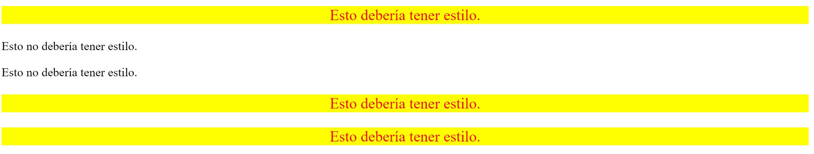

# Combinaciones descendientes
Comprender cómo funcionan los combinadores puede volverse mucho más fácil cuando comienzas a jugar con ellos y ves exactamente qué se ve afectado por ellos y qué no.

El objetivo de este ejercicio es aplicar estilos a elementos que son descendientes de otro elemento, dejando sin estilo los elementos que *no* son descendientes de ese elemento.

Puedes usar selectores de tipo o clase para este ejercicio; usa cualquiera con el que sientas que quieres practicar más. El archivo HTML está configurado (por lo que no es necesario editar nada en él) de modo que funcione cualquier combinación de selectores, por lo que si te sientes aventurero, puede incluso intentar combinar un selector de tipo *y* clase para el combinador descendiente.

Las propiedades que necesitas agregar son:

* Solo los elementos `p` que son descendientes del elemento `div` deben tener un fondo amarillo, texto rojo, un tamaño de fuente de 20px y alineados al centro.

## Resultado deseado

### Autoevaluación
- ¿Los elementos que contienen el texto "Esto debería tener estilo" tienen aplicados los estilos correctos?
- ¿Los elementos que contienen el texto "Esto no debería tener estilo" no tienen estilos aplicados?