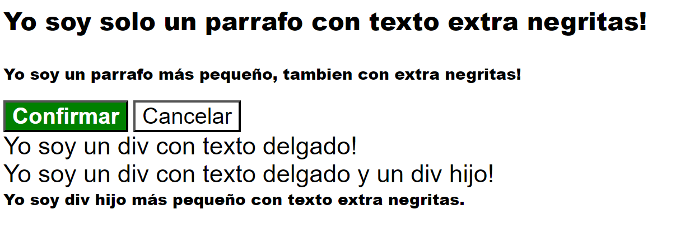

# Arreglar la cascada
Este ejercicio final de Fundamentos de CSS te dará una mirada más cercana a la cascada, en particular, la especificidad y el orden de las reglas. Tanto los archivos HTML como los CSS se completan por ti, por lo que en lugar de agregar reglas, simplemente editarás lo que se proporciona.

Hay algunos elementos que tienen algún tipo de problema de especificidad u orden de reglas en el archivo CSS proporcionado. Depende de ti averiguar qué problema está afectando a un elemento y cómo solucionarlo. Puedes editar el archivo CSS agregando, eliminando o editando selectores para un bloque de declaración, o moviendo los bloques de declaración. **No debes editar el archivo HTML ni ninguno de los estilos reales en el CSS**.

Hay varias formas de resolver este ejercicio.

Los problemas con la cascada pueden ser la ruina de tu existencia para muchos cuando se trata de CSS. Si bien no te convertirás en un experto en cascada solo con este ejercicio, y hay otras formas de lidiar con estos problemas, aún es muy útil ver cómo estos problemas afectan nuestros estilos finales y por qué es importante ordenar las reglas con cuidado.

## Resultado deseado

### Autoevaluación
- ¿Te aseguraste de no editar el archivo HTML?
- Si agregaste selectores al CSS, ¿apuntan a un elemento HTML válido?
